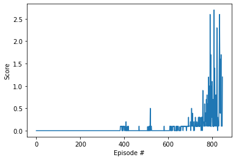

# Report

## Learning algorithm
Due to the continuous nature of the action-space, the specific algorithm used was similar, to MADDPG.
We took the DDPG algorithm from project 2 (Reacher) - as it worked quite well in solving that environment - and modified it for our collaborative problem:
- A single agent is trained. This agent controls both players.
- When it controls left player, it can use only left player state for the actor, but can also use the right player state for the critic (and vise versa.)
- Replay buffer stores not only the state/next state, but also the state and next state from our 'colleague' (the other agent with whom we are playing tennis.)
- For each sample, the reward is the sum of reward of both agents.
- At each time step, the replay buffer actually add 2 samples (one from each player.)
- The critic has access to the state/next state of the other agent - not the actor.

Our own implementation of the MADDPG agent can be found in the notebook Tennis.ipynb .

After collecting a large number of states in the replay buffer, we created vectors for the means and min/max values. This is used to 'normalize' the inputs.

Many hyper-parameters were tested. The ones that had the more clear and direct impacts were the discounting rate and soft update discounting factor.
The reward discount was reduced to 0.96 (compared to the usual 0.99) and the soft-update discount for target network was increased to 5e-2.

The following configurations/hyper-parameters were used:
- Reward discounting factor: 0.96
- Soft update parameter: 5e-2
- Exploration/randomness: Ornstein-Uhlenbeck process with standard deviation of 0.1
- Actor network: Fully connected network with layers (50, 50, 50, 20) and relu gates (and tanh activation to predict the action.)
- Critic network: Fully connected network with layers (100, 50, 50, 20) and relu gates (linear activation)
- Used a batch normalization layer after the first linear yaer (before activation) for both networks.
- Optimizer (for both networks): Adam with learning rate 1e-3 
- Replay buffer: memory size of 1e6 and batch size of 128.
- UPDATE_EVERY: 20 - every 20 time steps.
- UPDATE_NETWORK: 4 - runs 4 batches
- Warm up: Wait 1e3 time steps before starting updates.

   
## Solving the environment
The average reward between episodes 747 and 847 is 0.52 . We can then say that the environment
was solved after episode 747.

## Plot of rewards

## Ideas for future work

1. There are definitely opportunities of improving the agent through hyper-parameters tuning (including the architecture of the actor/critic networks in the MADDPG agent.)
2. It took many episodes to solve the problem, and quite a while to get our average score of 2 (since episodes take a while to run when the agent is good.) Prioritized replay could possibly help speeding up convergence.
3. We built our own MADDPG-ish algorithm. It would be interesting to compare with the actual MADDPG algorithm.

## Helper functions borrowed from https://github.com/ShangtongZhang/DeepRL
- from helpers.replay import UniformReplay
- from helpers.random_processes import OrnsteinUhlenbeckProcess
- from helpers.schedule import LinearSchedule
- from helpers.torch_utils import tensor, to_np
- from helpers.network_utils import layer_init